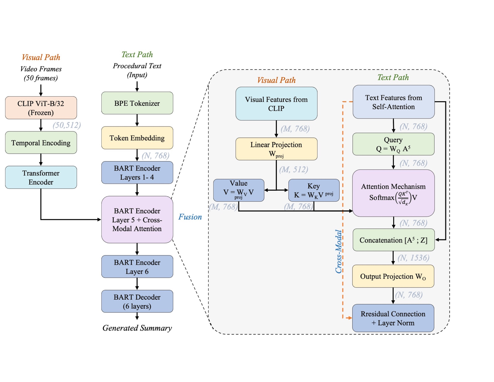

# ClipSum: Multimodal Abstractive Summarization of Instructional Videos with Vision-Language Models

This repository contains the official implementation of **ClipSum**, a multimodal framework for abstractive video summarization that leverages frozen CLIP vision-language features with BART through explicit temporal modeling and dimension-adaptive cross-modal fusion.

> **Paper:** "Multimodal Abstractive Summarization of Instructional Videos with Vision-Language Models"  
> Maham Nazir, Richong Zhang, Muhammad Aqeel, Francesco Setti  
> *International Conference on Pattern Recognition (ICPR) 2026*

---

## Overview

ClipSum addresses the semantic gap between visual and textual modalities in instructional video summarization. Traditional multimodal approaches rely on CNN features trained for object classification (e.g., ResNet-152), which represent visual concepts as discrete categories misaligned with natural language. ClipSum instead leverages CLIP's vision-language alignment, learned from 400M image-text pairs to obtain visual features inherently suited for text generation.

**Key results on YouCook2:**
- ClipSum achieves **33.0% ROUGE-1**, outperforming ResNet-based methods (30.5%) despite using **4× lower feature dimensionality** (512 vs. 2048)
- Frozen CLIP (33.0%) surpasses fine-tuned CLIP (32.3%), showing that preserving large-scale pre-trained alignment is more valuable than task-specific adaptation

---

## Architecture

ClipSum has three main components:

**1. Frozen Vision-Language Feature Extraction.**  
For each video, 50 frames are uniformly sampled and encoded through a frozen CLIP ViT-B/32 encoder, producing 512-dimensional features semantically aligned with text. CLIP parameters are kept frozen throughout training to preserve large-scale vision-language alignment.

**2. Explicit Temporal Modeling.**  
Learnable positional encodings are added to the CLIP frame features, which are then processed by a 2-layer Transformer encoder (4 attention heads, 1024 feed-forward dim) to model inter-frame dependencies and capture procedural action sequences.

**3. Dimension-Adaptive Cross-Modal Fusion.**  
A learnable linear projection maps CLIP's 512-dim features to BART's 768-dim space. At encoder layer 5, a cross-modal attention mechanism allows text representations to query visual features, computing queries from text and keys/values from projected visual features. The attended output is concatenated with text representations, projected back to 768 dimensions, and combined via a residual connection with layer normalization. The fused representation is then refined in encoder layer 6 before the BART decoder autoregressively generates the summary.


> *Figure: Architecture overview of ClipSum (see paper Figure 2 for full details).*

---

## Requirements

```bash
pip install -r requirements.txt
```

Key dependencies: PyTorch ≥ 2.0, HuggingFace Transformers ≥ 4.26, OpenAI CLIP, PyTorch Lightning ≥ 1.9.

---

## Dataset Preparation

### YouCook2

1. Download videos from the [official YouCook2 website](http://youcook2.eecs.umich.edu/).
2. The dataset contains 2,000 cooking videos across 89 recipe categories, split into 1,333 train / 457 validation / 210 test.
3. Procedural step descriptions are provided with the dataset. Abstractive summary targets were generated using GPT-3.5-turbo and manually verified (1,790 summaries for train/val, 210 for test).
4. Organize text data as follows:
```
data/youcook2/
├── sum_train/
│   ├── tran.tok.txt      # tokenized procedural step descriptions
│   └── desc.tok.txt      # tokenized summary targets
└── sum_cv/
    ├── tran.tok.txt
    └── desc.tok.txt
```

---

## Feature Extraction

Extract CLIP ViT-B/32 visual features (50 frames per video):

```bash
python scripts/extract_vl_features.py \
    --video_dir /path/to/videos \
    --output_dir ./features/youcook2/clip_vit_b32 \
    --model clip_vit_b32 \
    --num_frames 50
```

Extract ResNet-152 features (for baseline comparison):

```bash
python scripts/extract_resnet152_features.py \
    --video_dir /path/to/videos \
    --output_dir ./features/youcook2/resnet152
```

Or extract all features at once:

```bash
bash scripts/extract_all_features.sh
```

---

## Training

### YouCook2

```bash
bash scripts/train_all_vl_models.sh
```

Or manually with full hyperparameters:

```bash
python src/run.py \
    -model multi_modal_bart \
    -train_src_path "./data/youcook2/sum_train/tran.tok.txt" \
    -train_tgt_path "./data/youcook2/sum_train/desc.tok.txt" \
    -val_src_path   "./data/youcook2/sum_cv/tran.tok.txt" \
    -val_tgt_path   "./data/youcook2/sum_cv/desc.tok.txt" \
    -test_src_path  "./data/youcook2/sum_cv/tran.tok.txt" \
    -test_tgt_path  "./data/youcook2/sum_cv/desc.tok.txt" \
    -image_feature_path "./features/youcook2/clip_vit_b32/" \
    -visual_hidden_size 512 \
    -fusion_layer 5 \
    -cross_attn_type 1 \
    -dim_common 512 \
    -batch_size 16 \
    -learning_rate 3e-5 \
    -num_epochs 100 \
    -num_frames 50 \
    -max_input_len 512 \
    -max_output_len 128 \
    -max_img_len 50 \
    -n_beams 5 \
    -no_repeat_ngram_size 3 \
    -do_train True \
    -do_test True \
    -log_name "clipsum_youcook2" \
    -gpus 1 \
    -grad_accumulate 4
```

**Training details:** Adam optimizer (β₁=0.9, β₂=0.999, weight decay 1e-5), batch size 16 with gradient accumulation over 4 steps (effective batch 64), learning rate decays 5% every 10 epochs. Best checkpoint selected by validation ROUGE-2 with early stopping (patience 10). Trained on a single NVIDIA RTX 4090 (24GB).

---

## Evaluation

```bash
bash scripts/test_all_models.sh
```

---

## Citation

```bibtex
@inproceedings{nazir2026clipsum,
  title={Multimodal Abstractive Summarization of Instructional Videos with Vision-Language Models},
  author={Nazir, Maham and Zhang, Richong and Aqeel, Muhammad and Setti, Francesco},
  booktitle={Proceedings of the International Conference on Pattern Recognition (ICPR)},
  year={2026}
}
```

---

## Acknowledgements

This work was conducted at Beihang University, China and the University of Verona, Italy.  
Built on [BART](https://arxiv.org/abs/1910.13461) and [CLIP](https://github.com/openai/CLIP).  
We gratefully acknowledge the authors of [VG-GPLMs](https://github.com/HLTCHKUST/VG-GPLMs) whose open-source code provided the foundation for this work.